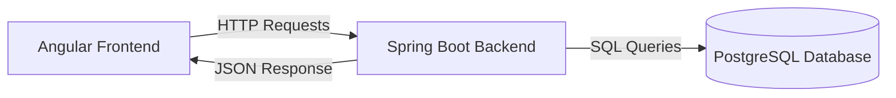
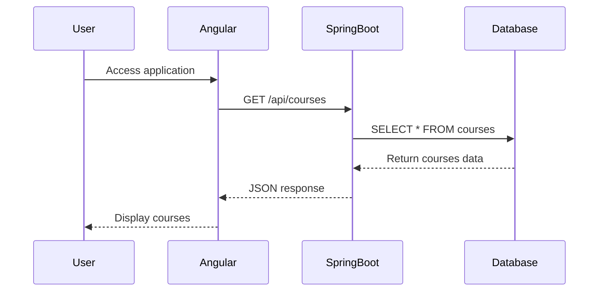

# How the Courses Management System Works

## System Architecture



## Components and Flow

1. **Frontend (Angular Application)**
   - Located in the `courses-app` directory
   - Built with Angular 19
   - Uses TypeScript for type safety
   - Communicates with backend via HTTP

2. **Backend (Spring Boot)**
   - Handles API requests
   - Manages database operations
   - Provides RESTful endpoints 

3. **Database (PostgreSQL)** 
   - Stores course information
   - Schema includes courses table with:
     - id (SERIAL PRIMARY KEY)
     - name (VARCHAR)
     - description (TEXT)

## How to Run the Application

### 1. Start the Backend Server
```bash
# Navigate to the root directory
cd /path/to/project

# Run the Spring Boot application
./mvnw spring-boot:run
```
The backend server will start at `http://localhost:8081`

### 2. Start the Frontend Application
```bash
# Navigate to the Angular application
cd courses-app

# Install dependencies
npm install

# Start the development server
npm start
```
The frontend application will be available at `http://localhost:4200`

## Using the Application

1. **View Courses**
   - Open your browser and navigate to `http://localhost:4200`
   - The application will automatically load and display available courses
   - Each course shows:
     - Course Name
     - Course Description

2. **Database Content**
   The application comes with sample courses:
   ```sql
   -- Sample courses in the database
   - "Comprehensive Software Project" (Learn HTML, CSS, and JavaScript)
   - "Python Basics" (Introduction to Python programming)
   - "DevOps Essentials" (Learn CI/CD, Docker, Kubernetes)
   ```

## Data Flow Diagram



## Technical Details

### Frontend Structure
```
courses-app/
├── src/
│   ├── app/
│   │   ├── courses/           # Courses feature module
│   │   │   ├── course.service.ts  # HTTP service for courses
│   │   │   ├── app.component.ts   # Root component
│   │   │   └── app.routes.ts      # Application routes
```

### API Endpoints

#### GET /api/courses
- **Purpose**: Retrieve all courses
- **Response**: Array of Course objects
- **Example Response**:
```json
[
  {
    "id": 1,
    "name": "Comprehensive Software Project",
    "description": "Learn HTML, CSS, and JavaScript"
  },
  {
    "id": 2,
    "name": "Python Basics",
    "description": "Introduction to Python programming"
  }
]
```

## Troubleshooting

1. **Backend Issues**
   - Ensure PostgreSQL is running
   - Check application.properties for correct database configuration
   - Verify the server is running on port 8081

2. **Frontend Issues**
   - Clear browser cache
   - Check console for JavaScript errors
   - Verify Node.js and npm versions
   - Run `npm install` if dependencies are missing

## Development Workflow

1. **Making Changes**
   - Frontend changes in `courses-app/src`
   - Backend changes in `src/main/java`
   - Database changes through SQL scripts

2. **Testing**
   - Frontend: `ng test`
   - Backend: `./mvnw test`

3. **Building for Production**
   - Frontend: `ng build --configuration production`
   - Backend: `./mvnw package` 
